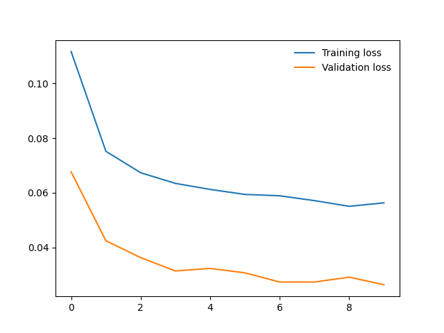

# udpj-image-classifier



An image classifier with Pytorch (for an udacity project).


PROGRAMMER: @nathanbangwa243

## 0. download_dataset.sh

PURPOSE: Download flowers dataset

* **Make the script executable using the following command:**
* 
```bash
chmod +x download_dataset.sh

```

* **Now, you can run the script:**
* 
```bash
./download_dataset.sh

```

## 1. train.py

PURPOSE: Train a new network on a data set using train.py

### Basic usage: 

```python
python train.py data_directory
```

Prints out training loss, validation loss, and validation accuracy as the network trains

### Options:

* **Set directory to save checkpoints:** 

```python
python train.py data_dir --save_dir save_directory
```

* **Choose architecture:** 

```python
python train.py data_dir --arch "vgg13"
```

* **Set hyperparameters:** 

```python
python train.py data_dir --learning_rate 0.01 --hidden_units 512 --epochs 10
```

* **Use GPU for training:**

```python
python train.py data_dir --gpu
```

### Concret Example

* **Use model trained with notebook**
```python 
python predict.py "flowers/test/1/image_06743.jpg" checkpoints/checkpoint-final.pth --gpu
```

## 2. predict.py

PURPOSE: TPredict flower name from an image using predict.py
   
### Basic usage: 

```python
python predict.py /path/to/image checkpoint
```

### Options: 

* **Return top-K most likely classes:** 

```python
python predict.py input checkpoint --top_k 3
```

* **Use a mapping of categories to real names:** 
 
```python
python predict.py input checkpoint --category_names cat_to_name.json
```

* **Use GPU for training:** 
 
```python
python train.py data_dir --gpu
```

### Concret Example

* **Use model trained with notebook**
```python 
python predict.py "flowers/test/1/image_06743.jpg" checkpoints/checkpoint-final.pth --gpu
```

* **Use model trained with train.py**
```python 
python predict.py "flowers/test/1/image_06743.jpg" checkpoints/checkpoint.pth --gpu
```